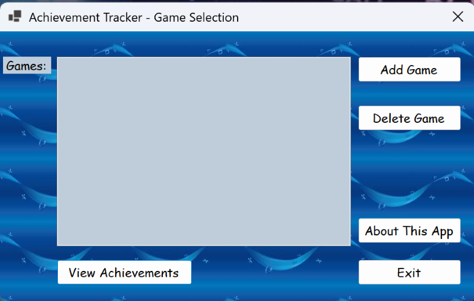
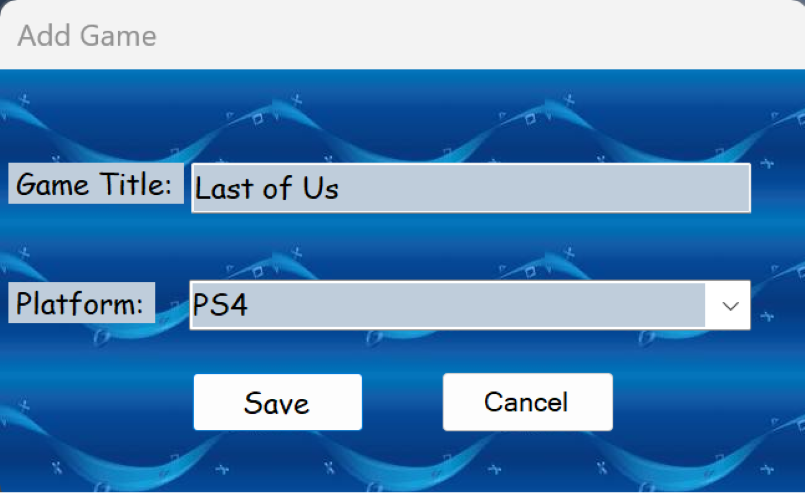
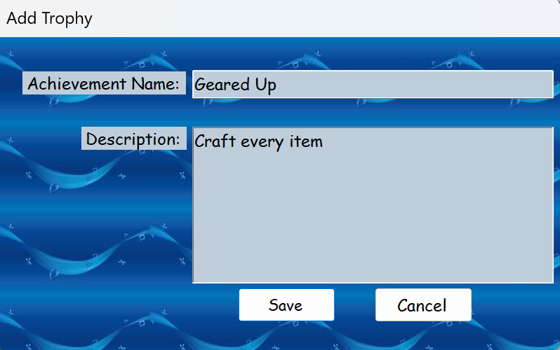
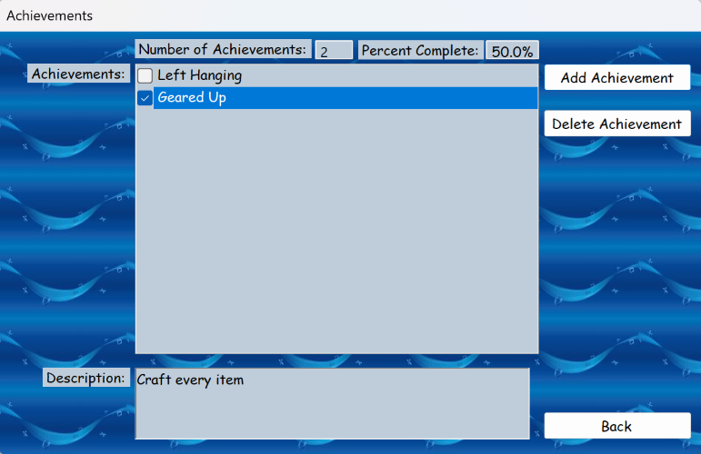
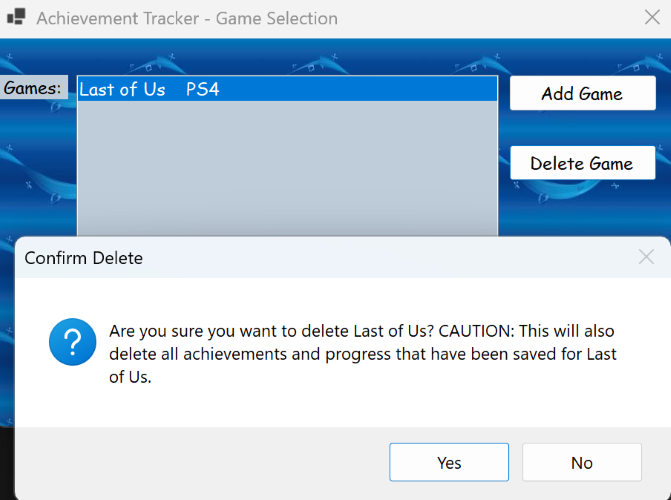
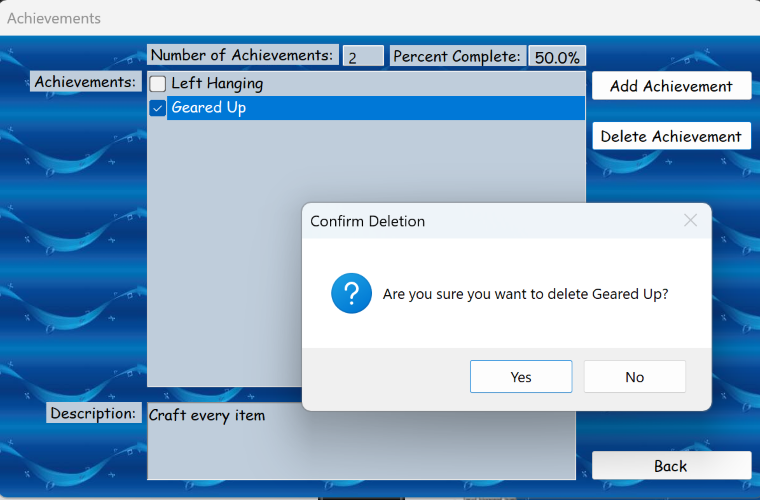

# 🎮 Achievement Tracker

> Track your video game achievements and progress across all your favorite titles.

---

## 👤 Author
Ben Stearns - [@bstearns07](https://github.com/bstearns07)

📅 Last Updated: 12-20-2023

---

## 📑 Table of Contents
- 📌 [Summary](#-summary)
- ⭐ [How It Works](#-how-it-works)
- ✨ [Features](#-features)
- 🧰 [Tech Stack](#-tech-stack)
- 🔧 [Development Tools](#-development-tools)
- 🧩 [Core Concepts](#-core-concepts)
- 📝 [New Topics Covered](#-new-topics-covered)
- 📘 [What I Learned](#-what-i-learned)
- 🖼 [Screenshots](#-screenshots)

---

## 📌 Summary

The **Achievement Tracker** is a Windows Form desktop application developed by **Ben Stearns** that allows users to track achievements and trophies across their video game library.

The application provides a simple and structured way to:
- Manage a list of games
- Track individual achievements per game
- Monitor progress using a checklist system

All data is persisted locally using text files, ensuring user progress is saved between sessions.

---

## ⭐ How It Works

1. **Add a Game**
   - Use the **[Add Game]** button to create a new game entry
   - The game is stored and displayed in the main list

2. **Select a Game**
   - Choose a game from the list
   - Click **[View Achievements]** to manage its achievements

3. **Manage Achievements**
   - Add achievements specific to the selected game
   - Use checkboxes to mark achievements as completed

4. **Data Persistence**
   - Game data and achievements are saved to local text files
   - Data is automatically loaded when the app starts

5. **Delete Functionality**
   - Games and their associated achievements can be permanently removed

---

## ✨ Features

- 🎮 Add and manage multiple game titles
- 🏆 Track achievements per game
- ✅ Checklist system for marking completion
- 💾 Persistent storage using text files
- ⚠️ Confirmation prompts for safe deletion
- 🧭 Simple and intuitive Windows Forms interface

---

## 🧰 Tech Stack

- **Language:** `C#`
- **Framework:** `.NET (Windows Forms)`
- **Storage:** `File I/O (Text Files)`
- **Architecture:** Object-Oriented Programming (OOP)

---

## 🔧 Development Tools

- 🛠️ Visual Studio
- 🧪 .NET Runtime
- 📁 Windows File System for storage

---

## 🧩 Core Concepts

- Object-Oriented Programming (Classes, Objects, Methods)
- File Handling (`StreamReader`, `StreamWriter`)
- Event-Driven Programming (Button Click Events)
- Windows Forms UI Development
- Data Persistence using local storage
- List collections (`List<T>`)

---

## 📝 New Topics Covered

- 📂 Reading and writing structured data to text files
- 🪟 Multi-form navigation in Windows Forms
- 🔄 Passing data between forms
- 📋 Dynamic UI updates using ListBox controls
- ⚠️ User confirmation dialogs (`MessageBox`)
- 🧹 Data cleanup and file deletion handling

---

## 📘 What I Learned

This project was my first exposure to programming at all. I've never written a line of code before taking Intro to Programming in C#, but a few months later I came up with this. With this being my first solo project coding a program from scratch, this became the culmination of everything I've learned so far from programming. I learned how to take the basics of programming such as variables, loops, data validation, arithmetic, user interfaces, and object-oriented programming into a fun and intuitive Windows Form Application. It's amazing what you can learn in just a few months.

Key takeaways include:
- Designing applications with **multiple forms and shared data**
- Implementing **persistent storage without a database**
- Managing **user input and UI updates dynamically**
- Structuring code using **clean, modular methods**
- Handling **edge cases and user errors gracefully**

---

## 🖼 Screenshots

### Home Screen

### Add Game

### Add Achievement

### Achievements List

### Delete Game/Achievement

---
